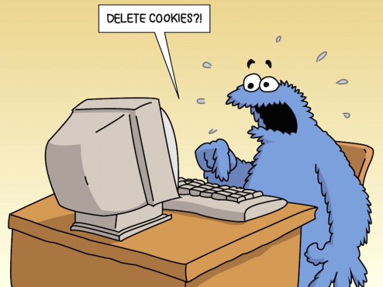

This just saves a step or two and clarifies some assumptions made when using [JavaScript Cookie](https://github.com/js-cookie/js-cookie). You’ll need to go there and download `js-cookie.js`.


First, link to `js-cookies.js` in your `<head>`. For example:
```
<script src="js-cookie.js"></script>
```


Next, link to `v0.cookies.js`.
```
<script src="v0-cookies.js"></script>
```


In `v0.cookies.js`, all you really need to do is write your scripts for whatever you want to happen when a user comes to your site with and/or without cookies.


For example:
```
v0cookies = function() {
  if (Cookies.get('cookies') == undefined) {

    // no cookies – do this stuff
    $('h1').append('Welcome!');

    // now set cookies
    Cookies.set('cookies', 'seen');
  } else {

    // cookies - do other stuff
    $('h1').append('Hi, again!');

  }
}
```


Finally, in your JavaScript, call
```
v0cookies();
```

Voila!


